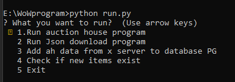

# World of Warcraft Auction house program

[comment]: <> (program do otwarzania zapisów z bazy blizzarda o aukcjach)
program to open scans from auction house in game world of warcraft 

 
# How to run
    
    :python run.py

#1.Run Auction house program
first option run GUI project with represent auction house from game

[comment]: <> (opcja pierwsza uruchamia program graficzny repezentujący auction house z gry )

[comment]: <> (1&#41; Select File, pozwala nam na wybór severa w postaci Json)
1) Select File, we can select file with we are intrested

[comment]: <> (2&#41; Search item, po znalezieniu serwera możemy znaleść interesujący nas przedmiot)
2) Search item, we could find item from game if it exist in auction house

[comment]: <> (3&#41; Po wyszukaniu przedmiotu dostajemy informacje jaka jest średnia cena, ile zapłacimy za uśrednioną wartość x procenta oraz ile zapłącimy z x przedmiotów)
3) After the item search we get information about avrage price, how much we pay from x item. 
#2. Run Json download program

1) Download server by id number
2) Download server by name
3) Download all servers
4) Return back to main menu

[comment]: <> (1&#41; w przygotowaniu)

[comment]: <> (2&#41; pobiera server przez id)

[comment]: <> (3&#41; pobiera server przez nazwe)

[comment]: <> (4&#41; pobiera wszystkie servery )

[comment]: <> (5&#41; Wraca do okna startowego )

#3. Add ah data from x server to database

1) Check if files by id exist in PostgressDB if not adding them to Database

[comment]: <> (1&#41; sprawdza czy dane pliki o danym id istnieją w bazie jeżeli zostały utworzone nowe dodaje je)
2) Check if files by name exist in PostgressDB if not adding them to Database

[comment]: <> (2&#41; sprawdza czy pliki o danej nazwie istnieja w bazie jezeli zostały utworzone nowe dodaje je)
3) Checking all files if is new file adding it to PostgressDB

[comment]: <> (3&#41; sprawdza pokolei każdy server jeżeli zostały dodane nowe pliki dodaje je do bazy danych)
4) Return back to main menu

#4. Check if new items exist

Checking if new items are in josn if yes find they name and picture then download it.

# In progress:

1) Represent x days of item price as chart
